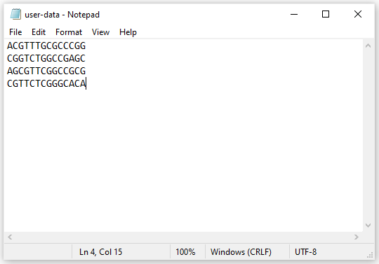

```{r setup, include=FALSE}
knitr::opts_chunk$set(echo = TRUE)
```


User inputted data should be in a .txt file. The format for the text document should be:

- Each DNA sequence should have their own line
- Each DNA sequence should only have the characters "A", "G", "T", and "C".
- No header
- If you plan on using the Bcrank method, your DNA sequences should be ordered from most important to least important.
  - See the Bcrank method description for further information.

Below is an example for how the text file should look.


